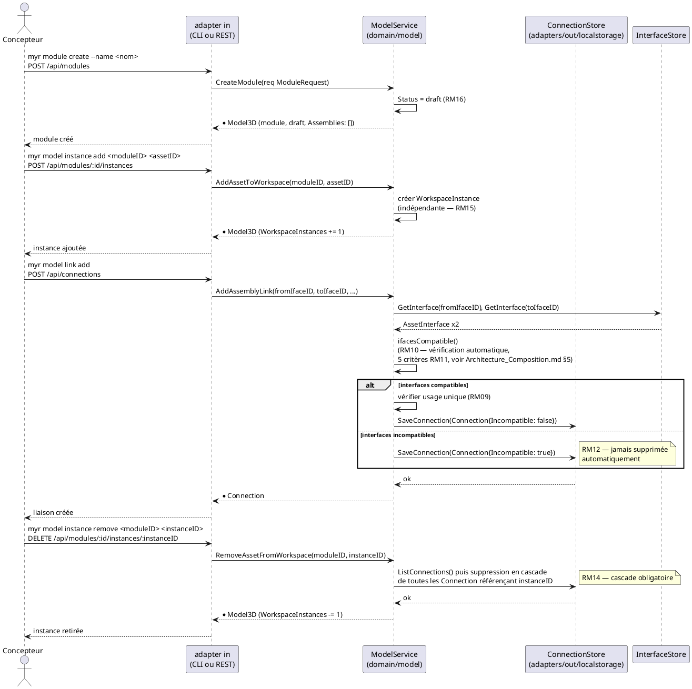
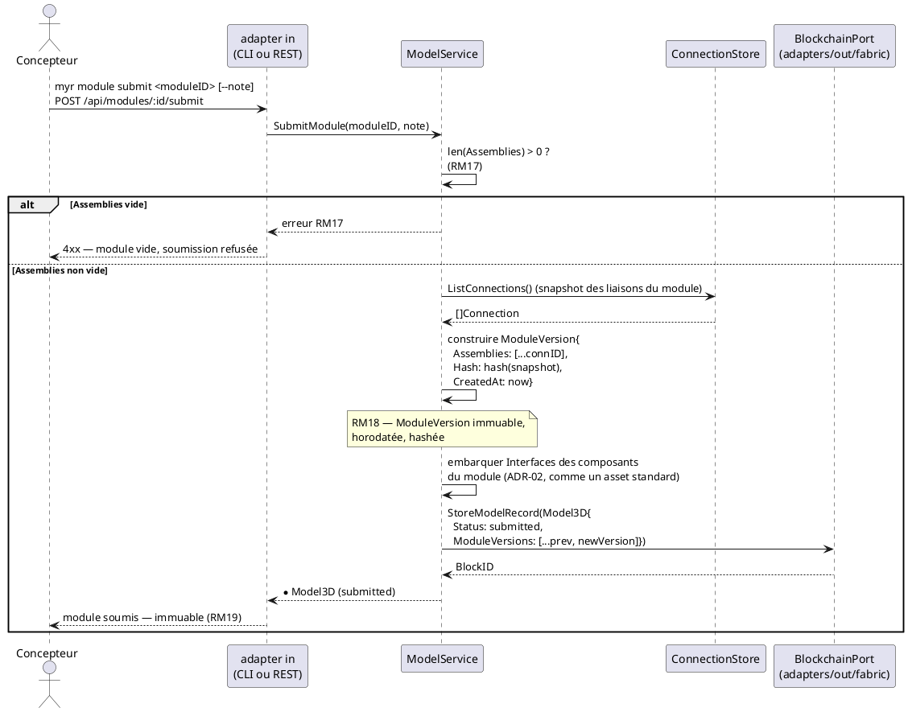

# Séquence — Composition et soumission d'un module (D5/D6)

> Phase 3 — Arrington | Use cases : UCMOD01, UCMOD02, UCMOD06, UCAM01, UCAM07, UCAM08 | Domaine : `domain/model`

---

## 1. Objectif

Diagramme de séquence couvrant le cycle complet d'un module : création (`draft`, RM16), composition (instances + liaisons, mutable et locale), et soumission (`SubmitModule`, RM17/RM18). Complète `Architecture_Composition.md` §3 (diagramme d'états) et §9 (ADR-05).

---

## 2. Création et composition (état `draft`, entièrement local)

---

## 3. Soumission (`SubmitModule` — RM17/RM18, transaction unique)

---

## 4. Notes

- La composition (§2) reste entièrement locale et mutable — aucune transaction Fabric n'est déclenchée avant `SubmitModule` (ADR-05). C'est ce qui garantit les exigences de temps de réponse UCAM (`< 200 ms` / `< 300 ms`, `Conception_intro.md` §6 ADR-02).
- Une fois `submitted`, toute modification du module doit passer par un fork (RM19) — état de cette garde : `specs/roadmap_dev.md` § Écarts structurels — modèle & chaincode, E5. Ce diagramme ne représente pas le chemin de fork, qui reste à concevoir au niveau service.
- Le retrait en cascade (§2, dernier bloc) est la seule opération de composition qui modifie un état déjà persisté localement (les `Connection` liées) — elle reste néanmoins purement locale tant que le module n'est pas soumis.
